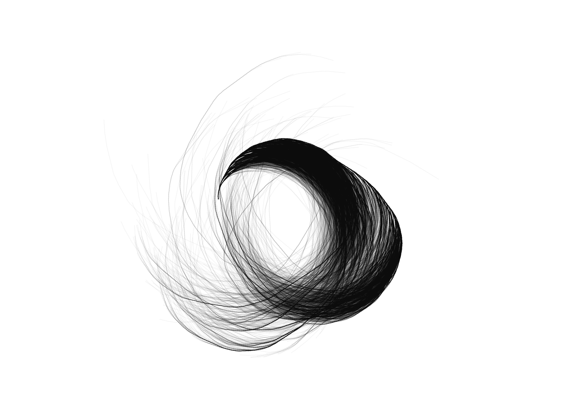

# Visualization of the Collatz Conjecture

See [Collatz Conjecture - Wikipedia](https://en.wikipedia.org/wiki/Collatz_conjecture) for more information.

This code has been uploaded on March 14th - Pi Day. Therefore you will find a significant number of unnecessary calculations involving PI when drawing the output.

This algorithm uses an optimization method to reduce the number of overlapping trees.
* If a new branch is extending an already existing branch, it will replace it in the tree.
* If a new branch is a subset of an already existing branch, it will not be added as it is already part of the longer branch.
* If a new branch is indeed new, it will spawn a new branch in the tree.

When rendering the final output, the algorithm takes a number in the tree and draws a line to the previous number, where the length of the line is always the same size. In case a number is even, the canvas rotates in a positive angle - if the number is odd, the canvas rotates in a negative angle.

Depending on the rendering mode, a different starting point needs to be determined.

The default values can cause browser performance issues, as the initial Collatz Tree is built for 120587 numbers.

## Output

